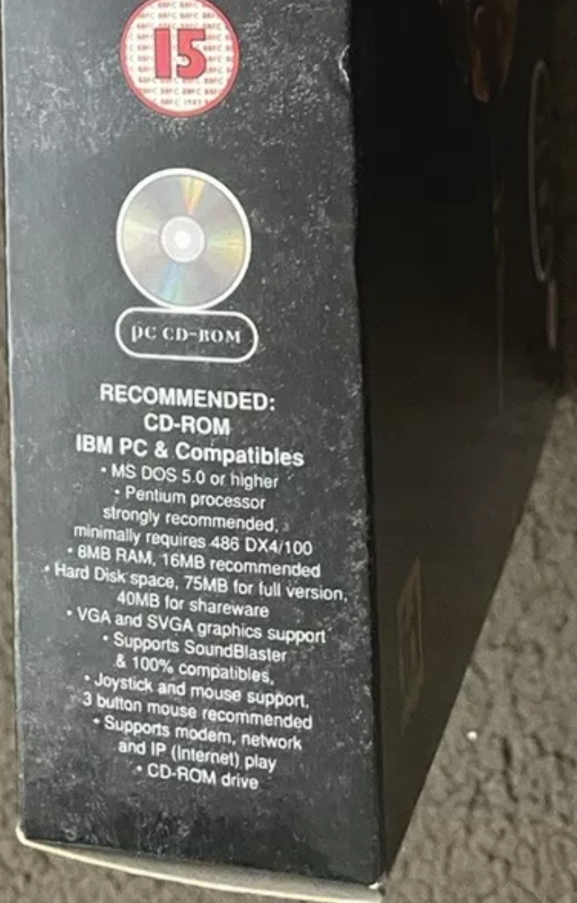

Contributors  
[DOOMReboot](https://github.com/DOOMReboot): Review/Edit  
[kevansevans](https://github.com/kevansevans): Suggestions  

# Notes 000 - Introduction  
After looking into DOOM code and gaining some knowledge, I wanted to look at another id Software game's source, and the next step from DOOM is Quake! I have lots of memories playing Quake! I still remember playing on my Pentium running at 90MHz with 8MB of RAM. What an experience it was (and still is).

Remember, I am just a computer graphics hobbyist, so before jumping into Quake code, I decided to learn more about 3D math and computer graphics. I have learned a lot, and, at some point, I want to go back to DIYDOOM and start it from scratch. Looking at DIYDOOM now, there is a lot I can improve, but sometimes you must move forward and not keep iterating on the same thing (don't worry, I will go back and improve upon it at some point).

My approach implementing DIYQuake will be different; I will try to keep things much closer to how Quake implemented things (Like what the Handmade Quake project was doing. What a bummer that project got canceled).  

As is was the case with DIYDOOM, I will be sharing my notes. Maybe they will help someone else break their fears looking at the game engine source code. Also, I will try to keep detailed documentation of my progress and findings within the Quake code.  

My focus will be on WinQuake; it is the software rendering version of Quake that was designed to run on Windows 95. What makes Quake stand out from earlier id Software titles is that Quake used, 3D models, and 3D rendering pipeline (allowing for rooms on top of each other, unlike in DOOM), both lightmaps, and dynamic lighting, and lots more! It is also important to note that the game requred a CPU with a FPU (Floating point unit). This is why the Pentium processor was required to run the game.
**Note:** All Pentium processors came with an FPU, but not all 486 did.


## Quake Game Requirements
To relive the release of Quake, it's a good idea to take a look at the game's requirements. Here is a look at the back of the tri-fold CD case:
  
  
  
Due to the size of the game's assets, a whopping ~50MB, Quake was released on a CD-ROM.    
**Note:** Yes, 50MB back then was a lot of space. I only had a 500MB HDD.   
**Note:** I have seen few boxs variants that mentioned 486 DX4 / 100MHz is supported (DX4 is a 486 with a FPU)

  

Here is [another box veriant](./img/box2.png), which explicitly say "absolutely must have a math copprocessor!".  

After the release of Quake in 1996, the game received a handful of updates during its lifetime. The most notable update was V1.09 which added OpenGL hardware acceleration support.

I was able to get my hands on two different Quake CD releases, V1.06 and V1.09. Both versions came with different binaries but had identical PAK files. The PAK files contain the game's assets: texture, models, maps, etc. Here is a listing of the Quake directory after installation:

V1.06 CD-ROM  

``` console
QUAKE
COMEXP.TXT  CWSDPMI.EXE GENVXD.DLL   HELP.TXT    LICINFO.TXT
MANUAL.TXT  MGENVXD.VXD ORDER.TXT    PDIPX.COM   Q95.BAT
QLAUNCH.EXE QUAKE.EXE   QUAKEUDP.DLL README.TXT  RESOURCE.EXE
RLICNSE.TXT TECHINFO.TXT

QUAKE\ID1
CONFIG.CFG   PAK0.PAK    PAK1.PAK
```

**Note:** this release only came with DOS Quake version  
**QUAKE.EXE** Software rendering for DOS


V1.09 CD-ROM  

``` console
QUAKE
CWSDPMI.EXE  FXMEMMAP.VXD GENVXD.DLL   GLQUAKE.EXE  MGENVXD.VXD
OPENGL32.DLL PDIPX.COM    PMPRO16.DLL  PMPRO32.DLL  Q95.BAT 
QLAUNCH.EXE  QUAKE.EXE    QUAKEUDP.DLL VQUAKE.EXE   WDIR16.DLL 
WDIR32.DLL   WDIRNOP.COM  WDIRNOP.PIF  WINQUAKE.EXE WQ.BAT

QUAKE\DOCS
QUAKE.CNT QUAKE.HLP

QUAKE\DOCS\DOS
3DFX.TXT     COMEXP.TXT   GLREADME.TXT  HELP.TXT    JOYSTICK.TXT 
LICENSE.TXT  LICINFO.TXT  MANUAL.TXT    ORDER.TXT   README.TXT 
TECHINFO.TXT WQREADME.TXT

QUAKE1_09\ID1
CONFIG.CFG   PAK0.PAK      PAK1.PAK

QUAKE1_09\ID1\GLQUAKE
15TO8.PAL     RMOR.MS2     BACKPACK.MS2   BOLT.MS2     BOLT2.MS2 
BOLT3.MS2     DEMON.MS2    DOG.MS2        EYES.MS2     FLAME.MS2
FLAME2.MS2    GIB1.MS2     GIB2.MS2       GIB3.MS2     GRENADE.MS2
G_NAIL.MS2    G_ROCK.MS2   G_SHOT.MS2     H_DEMON.MS2  H_DOG.MS2 
H_GUARD.MS2   H_OGRE.MS2   H_PLAYER.MS2   H_WIZARD.MS2 H_ZOMBIE.MS2 
INVISIBL.MS2  LAVABALL.MS2 MISSILE.MS2    OGRE.MS2     PLAYER.MS2 
QUADDAMA.MS2  SOLDIER.MS2  SPIKE.MS2      SUIT.MS2     S_SPIKE.MS2 
V_AXE.MS2     V_LIGHT.MS2  V_NAIL.MS2     V_NAIL2.MS2  V_ROCK.MS2 
V_ROCK2.MS2   V_SHOT.MS2   V_SHOT2.MS2    WIZARD.MS2   W_G_KEY.MS2 
W_SPIKE.MS2   ZOMBIE.MS2   ZOM_GIB.MS2 
```

**Note:** V1.09 came with four different binaries to run Quake   
**QUAKE.EXE** Software rendering for DOS  
**WINQUAKE.EXE** Software rendering for Windows  
**VQUAKE.EXE** Hardware-accelerated rendering for [Verite V1000 accelerator](https://en.wikipedia.org/wiki/Rendition_(company))    
**GLQUAKE.EXE** Hardware accelerated OpenGL version  

If you buy the Steam version of Quake, you will get V1.09 and Quake world binaries.
As of August 19 2021, a remaster version of Quake was released, a new "rerelease" folder with a new PAK file can be found under the installion folder.

Some interesting differences when comparing the CD-ROMs:

V1.06 CD-ROM  
* The size is only 24MB  
* Everything on the CD is compressed  
* A full install is required to play the game  

V1.09 CD-ROM  
* The size is 78MB  
* Includes an uncompressed "Data" folder  

My initial thought was that the differences in V1.09 were to allow the game to run from the CD-ROM (by having a minimum installation mode and then reading the assets from the CD-ROM), but the Windows installer never gave such an option; A complete installation was required to play the game under Windows. It just seems weird to me, especially since the game's source code seems to support reading assets from any location.  

## Source Code
A copy of [Quake source code](https://github.com/id-Software/Quake) can be found on id Software's GitHub account.

But the question is, how can you compile the code and get a working binary? This is what I will be explaining next. 

## Goal
Compile original WinQuake

## Compiling the code
The easiest way to get the code to compile is to find a Windows 9x machine (maybe a virtual machine) and install Visual Studio 6. Then, with no code changes, you would open the [works space](https://github.com/id-Software/Quake/blob/master/WinQuake/WinQuake.dsw) file and compile the project. However, that is not what you might want; you'll likely want this code to compile under a modern operating system with a newer version of Visual Studio.  

**Note:** You might need to do an EOL (end of line) conversion. The files checked into the GitHub repo are in Unix EOL format; Win98 will not recognize the format as-is.

The source code for Quake that id Software released comes with Quake and Quake World. Our focus is WinQuake.

All you need to do to be able to get Quake compiled under a newer version of Visual Studio is to create a new Project and go through [WinQuake Project File](https://github.com/id-Software/Quake/blob/master/WinQuake/WinQuake.dsp) to see which header files (.h), source files (.cpp), and libraries (.lib) need to be added to your project. 

I'll next describe a quick summary of the process. Don't worry; I have got you covered. 
If you are not interested in this process, you can also grab the solution here: [Visual Studio 2019 Solution](../src).  

**Note:** When installing VS2019, do not forget to install MFC and the Windows SDK.  

[WinQuake.dsp](https://github.com/id-Software/Quake/blob/master/WinQuake/WinQuake.dsp) is a simple text file that lists compiler flags and files that are included in the project.

Looking at the project file, it builds four targets. 

```
winquake - Win32 Release
winquake - Win32 Debug
winquake - Win32 GL Debug
winquake - Win32 GL Release
```

What we are interested in are the Release and Debug versions, so skip the OpenGL version.

Here is what you will need to do while going through the workspace file:

Add the scitech include folder:

``` console
.\scitech\include
.\dxsdk\SDK\INC
```

Add the scitech lib to your project:

``` console
.\scitech\lib\Win32\VC
.\dxsdk\SDK\LIB
```

Here are the only libraries you will need to add:

```
Winmm.lib
DXGUID.LIB
wsock32.lib
MGLLT.LIB
```

Some functions have two different implementations, assembly ```*.s``` and C versions. I will be ignoring the assembly implementations and get things working with the C versions. It is worth noting that John Carmack stated that if we compile using the C implementations, we will lose almost half the performance [compared to assembly](https://github.com/id-Software/Quake/blob/master/readme.txt).

A complete list of all the files you will need:

``` console
adivtab.h    anorms.h    anorm_dots.h bspfile.h
cdaudio.h    client.h    cmd.h        common.h
conproc.h    console.h   crc.h        cvar.h
draw.h       d_iface.h   d_local.h    input.h
keys.h       mathlib.h   menu.h       model.h
modelgen.h   net.h       net_dgrm.h   net_loop.h
net_vcr.h    net_wins.h  net_wipx.h   progdefs.h
progs.h      protocol.h  pr_comp.h    quakedef.h
render.h     resource.h  r_local.h    r_shared.h    
sbar.h       screen.h    server.h     sound.h
spritegn.h   sys.h       vid.h        view.h
wad.h        winquake.h  world.h      zone.h    

cd_win.c     chase.c     cl_demo.c    cl_input.c
cl_main.c    cl_parse.c  cl_tent.c    cmd.c
common.c     conproc.c   console.c    crc.c
cvar.c       draw.c      d_edge.c     d_fill.c
d_init.c     d_modech.c  d_part.c     d_polyse.c
d_scan.c     d_sky.c     d_sprite.c   d_surf.c
d_vars.c     d_zpoint.c  host.c       host_cmd.c
in_win.c     keys.c      mathlib.c    menu.c
model.c      net_dgrm.c  net_loop.c   net_main.c
net_vcr.c    net_win.c   net_wins.c   net_wipx.c    
nonintel.c   pr_cmds.c   pr_edict.c   pr_exec.c
r_aclip.c    r_alias.c   r_bsp.c      r_draw.c 
r_edge.c     r_efrag.c   r_light.c    r_main.c
r_misc.c     r_part.c    r_sky.c      r_sprite.c
r_surf.c     r_vars.c    sbar.c       screen.c
snd_dma.c    snd_mem.c   snd_mix.c    snd_win.c
sv_main.c    sv_move.c   sv_phys.c    sv_user.c
sys_win.c    vid_win.c   view.c       wad.c
world.c      zone.c 

progdefs.q1  progdefs.q2

quake.ico

winquake.rc
```

**Note:** If you see any compiler errors, Google them; they are changes in the Windows APIs and headers, they should be straightforward to fix.
**Note:** After getting the code to compile, I noticed some of those files are not needed, but for now, I will leave them there.  

## Running and Debugging
Now you should be able to run the game just by clicking the Run button. If it doesn't, you might need to change the working directory folder in Settings to help the WinQuake binary find the id1 folder where the game assets are. I have included the Shareware version of the assets under [external/Assets](../../external/Assets).

**Note:** You can add ```-startwindowed``` as a startup argument if you want the game to start in Window mode.  

**Note:** For debugging, you can set breakpoints in the code or call the function ```Con_Printf``` and print the output strings to the Quake console! Don't forget to add ```-condebug``` as a startup argument which will dump all the Quake console text to a ```qconsole.log``` file for you.  

## Notes
I will be keeping two copies of the original code. The first copy of the code is under the [Notes000/src](../src) folder; this is WinQuake as it was released by id Software (with minimal changes to get it to compile). The second copy is under the [misc](../../misc/src) folder, which I will be using for debugging and tracing. I will also be adding comments and renaming variables to help me trace and understand the code.  

## Contributions  
I'm not perfect, so please contact me if you find errors, bugs, concerns, or find yourself in disagreement with anything. We are all here to learn, and you will be credited.  
