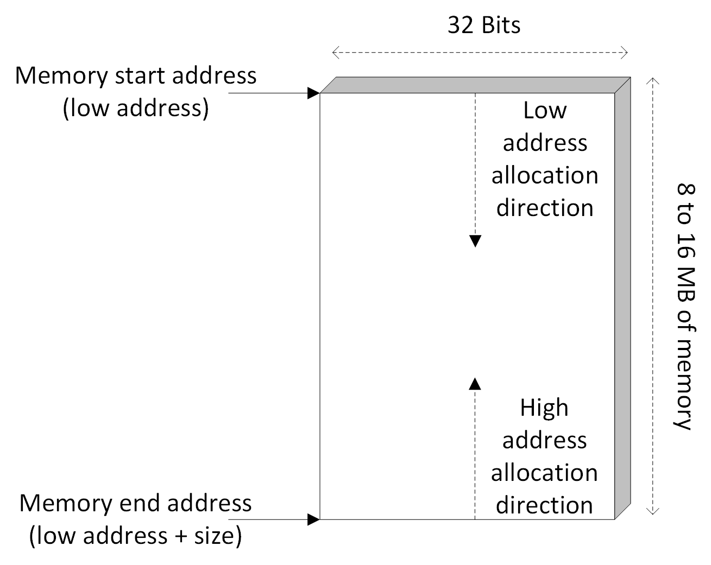
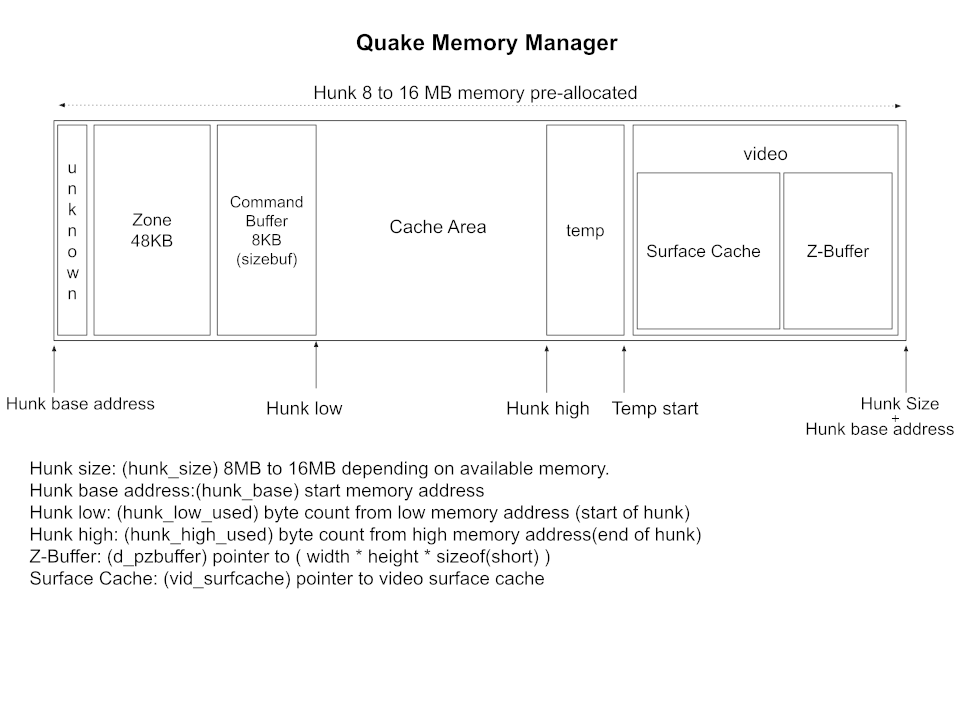
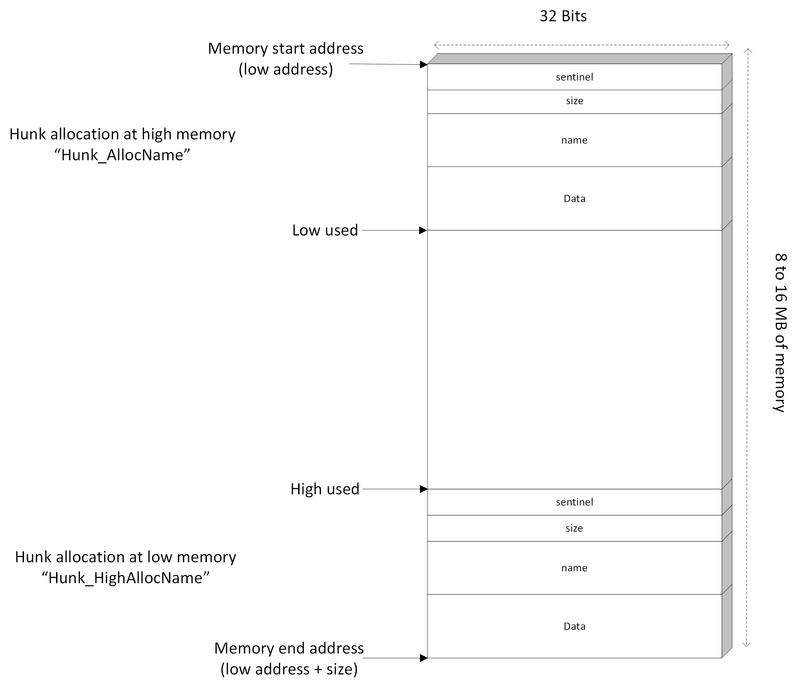
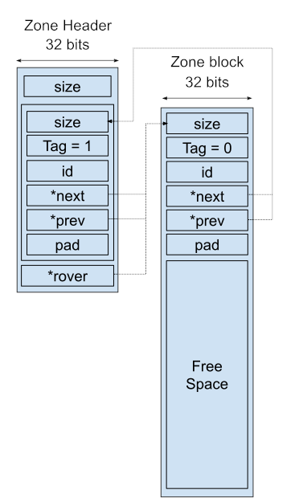
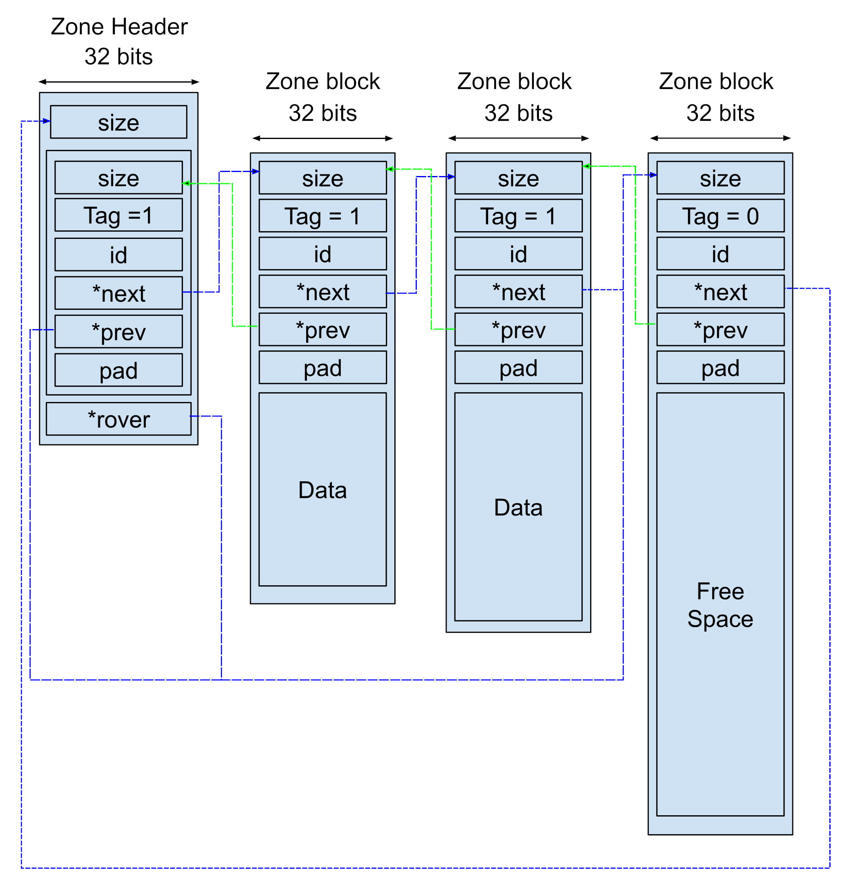
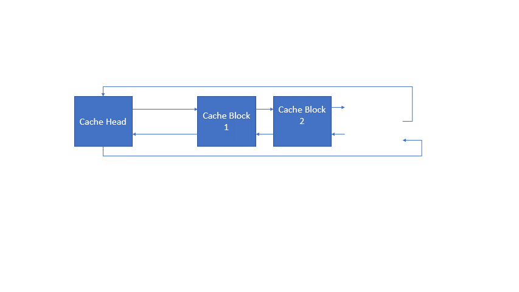
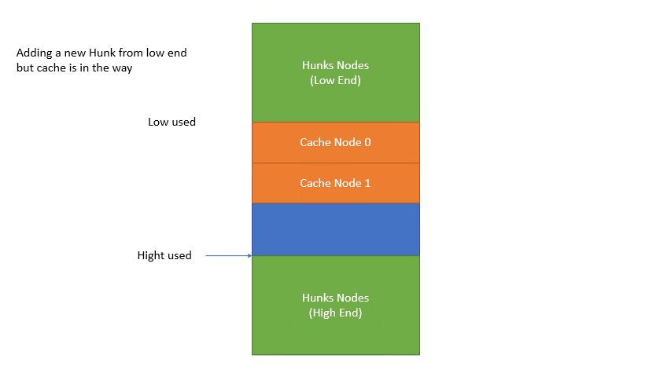

# Notes 002 - Memory Management  
One of the main subsystems in Quake is the memory manager; we cannot do much if we cannot allocate and de-allocate memory. Initially, I started implementing DIYQuake without a memory manager, just calling "new" and "delete" all over the code, then I backed out; I do not want to make the same mistakes I did when I was building DIYDOOM.  

Building your memory manager is not easy. It gets chaotic and becomes a source of bugs if you do not know what you are doing. You can tell from Quake source that this was the case. The memory manager has functions to check for memory corruption. Here is a snippet of code from Quake memory manager!  

```cpp
#ifdef PARANOID
    Hunk_Check();
#endif
```

The code speaks for itself. Building your memory manager could get you paranoid!  

Enough rambling, now get ready for a long heavy talk and some surprises!  

## Goals
* Understand Quake memory manager.
* Implement smiler memory manager.

## Introduction
Quake memory manager is designed and optimized for Quake needs, and it is more advanced than DOOM's. Here are some advantages that Quake memory manager provides.    
*  Skips calling OS APIs to allocate/dealate memory, leading to better performance (malloc calls OS APIs behind the scenes).  
*  Pre-allocated all needed memory beforehand, no running out of memory while playing Quake.  
*  A more refined control on memory.  
  
Quake box states that it requires a minimum of 8MB of RAM to run Quake and allocate up to 16MB if the system has enough available. Most of the memory manager functionality exist in [zone.c](../../Notes000/src/WinQuake/WinQuake/zone.c).  
  
Quake memory manager journey start at WinMain in [sys_win.c](../../Notes000/src/WinQuake/WinQuake/sys_win.c#L776). WinMain calls the windows API ```GlobalMemoryStatus (&lpBuffer);```, which would return the memory status in the struct ```lpBuffer```. Based on the memory available, a decision is taken. Let us have a closer look at the code.  

Note: Notice that the logic is implemented in ```sys_*.c```. It is OS-specific. The logic we are about to discuss is for Win9x and does not apply to DOS, Linux, etc.  

```cpp
// take the greater of all the available memory or half the total memory,
// but at least 8 Mb and no more than 16 Mb, unless they explicitly
// request otherwise

// Set memory to the physical memory currently available
parms.memsize = lpBuffer.dwAvailPhys;

// Make sure we can allocate the min. amount of memory
if (parms.memsize < MINIMUM_WIN_MEMORY)
   parms.memsize = MINIMUM_WIN_MEMORY;

// Is half of the memory more than MINIMUM_WIN_MEMORY?
// The bit shift is just dividing by 2
if (parms.memsize < (lpBuffer.dwTotalPhys >> 1)) 
   parms.memsize = lpBuffer.dwTotalPhys >> 1;

// Clamp the memory to MAXIMUM_WIN_MEMORY value
if (parms.memsize > MAXIMUM_WIN_MEMORY)
   parms.memsize = MAXIMUM_WIN_MEMORY;

// Was a specific value passed as a parameter to the EXE?
if (COM_CheckParm ("-heapsize"))
{
   t = COM_CheckParm("-heapsize") + 1;

   if (t < com_argc)
      parms.memsize = Q_atoi (com_argv[t]) * 1024;
}

// Allocate the selected amount of memory
parms.membase = malloc (parms.memsize);

// Will take about this function below
Sys_PageIn (parms.membase, parms.memsize);
```

And the "selected" amount of memory is allocated. So now, let's look at MINIMUM_WIN_MEMORY and MAXIMUM_WIN_MEMORY values.  

```cpp
// FYI               8MB = 0x0800000
#define MINIMUM_WIN_MEMORY 0x0880000 // = 8912896 bytes = 8912896 / 1024 / 1024 = 8.5 MB ??? 
#define MAXIMUM_WIN_MEMORY 0x1000000 // = 16777216 bytes = 16777216 / 1024 / 1024 = 16 MB 
```

Oh!!! What is going on? Something is not correct; they said 8 MB (not 8.5 MB)! Also, I am sure the game ran fine on my 8MB Win95 PC back then. But how is that possible? How come the game would try to allocate 8.5MB where the available was just 8MB? Not only that, thinking about it, we did not consider the Quake EXE size loaded in memory. 

Let me explain the magic behind this. In Windows 9x you can allocate more memory than the system physically had. Windows 9x came with a VMM (virtual memory manager). VMM would trick the applications into thinking that their data is stored somewhere in memory but is not. The data that was supposed to be in memory should exist somewhere, it would live on the hard disk (and known as the swap file), and they get moved to memory when accessed or needed (this process is known as "page in", if the data is moved from memory to hard disk it is called "page out"). The VMM uses a paging table to track what information is stored on the hard disk and what information is in physical memory. You can read more about it here [Windows 9X Virtual Memory](http://www.cwdixon.com/support/win98_support/virtual_memory.htm)  

Note: If you are wondering, DOS binary allocates memory in a different way that would all fit in an 8MB.  

Now that you know what "paging in" is, this should explain what ```Sys_PageIn``` call does. It does not do much other than trying to access Quake's memory range to force the VMM in Win9x to load Quake pages in memory.  

Nowadays, computers come equipped with 16GB of RAM (1000 times more than computers back in 1996), so for DIYQuake implementation, I will stick with 16MB.  

After WinQuake is given the allocated memory, it gets one big piece of memory, and it knows two facts, starting address returned by the ```malloc``` which is the (low end) and the high address, which can be calculated using start address + size.  

  

Since this is a significant amount of memory, it will not be useful and needs to be broken into smaller pieces.  

Quake memory manager splits the memory into what it calls "hunks". Those hunks of memory are then used by the code that requested the allocation. Not all hunks behave the same way; few hunks are designed to behave differently, like zone and temp hunks.  



The layout shows the significant hunks in the memory, there are a handful of other hunks, but I omitted them to make things look simpler. This visualization will help us understand as we explain.  

Now let us focus on hunks and how they work.  

## Hunks
 Hunks can be created from both the lower and the high end of the memory, using the functions ```void* Hunk_AllocName(int size, char* name);``` and ```void* Hunk_HighAllocName(int size, char* name);```. Two indexes are used to keep track of how much memory is consuming from both ends. Those hunks are allocation done in a stack fashion. So, no gaps in between hunks.  

Hunk de-allocation is also in stack fashion LIFO (last in, first out). You cannot delete hunk, causing a gap in between hunks. So, we have two de-allocation functions, one to de-allocate at low memory address and one at the high memory address, ```void Hunk_FreeToLowMark (int mark)``` and ```void Hunk_FreeToHighMark (int mark)```. The stack fashion of allocation and de-allocation is very limiting. We will investigate how the memory manager solved that issue later, but for now, let's have a closer look at a single hunk.  

Each hunk is given a header as follows.  

```cpp
typedef struct
{
    int  sentinal; // should be 0x1df001ed
    int  size; // including sizeof(hunk_t)
    char name[8]; // hunk name
} hunk_t;
```
 
 * ```int sentinal``` is a memory sanity value, which is always set to "0x1df001ed" and I always read it as "id fooled". This is used in debugging and validating for memory corruption.    
 * ```int size``` Size of the hunk (using the start address of the hunk and the size you can get to the next hunk).  
 * ```char name[8]``` name of the hunk. Hunks can be given a name!  

Note: a helper function ```void* Hunk_Alloc(int size);``` would allow a hunk to be created without a name being passed, the function will call ```void* Hunk_AllocName(int size, char* name);``` passing "unknown" as the name.  



You can quickly iterate through the hunks; if you have the memory start address, get the current hunk size, and add that to the hunk address, which should get you to the next hunk. Hunks are always 16 bytes aligned.  

Now that we have a basic understanding of how hunks work let's talk about two special case hunks.
Zone hunk and Temp Hunk. Those two hunks are designed to solve specific problems.

## The Zone Hunk
Zone hunk is created as part of the memory initialization function. The Zone is created in the lower address of the allocated memory. The Zone size is 48KB but can be changed if "-zone" was passed as a parameter to Quake EXE. The primary purpose of the zone hunk is to provide more flexible allocations and de-allocation to small blocks of memory that Quake code might need. (suitable for string concatenation or manipulation etc.). The memory manager provides specialized functions to allocated and de-allocate memory within the zone hunk.  

But why do we need the zone hunk, you might ask? Why can't we allocate and de-allocate hunks? To avoid memory fragmentation and overcome the stack behavior limitation by keeping small memory allocation within the zone hunk.  

The memory manager provides the function ```void *Z_Malloc (int size);``` to allocate memory within the Zone. The ```Z_Malloc``` function internally calls a helper function ```void *Z_TagMalloc (int size, int tag);``` with the tag being always set to 1. Zone memory blocks are 8 bytes aligned.  

The zone hunk gets broken into blocks based on the Quake needs. Let's have a look at the zone block definition.

```cpp
typedef struct memblock_s
{
    int size; // including the header and possibly tiny fragments
    int tag;  // a tag of 0 is a free block
    int id;   // should be ZONEID (0x1D4A11, "id for all")
    struct memblock_s  *next, *prev; // next and previous pointers
    int pad;  // pad to 64-bit boundary
} memblock_t;
```

The Zone is a simplified version of the [free list data structure](https://en.wikipedia.org/wiki/Free_list), which is a double liked list, so each block has its own next and previous pointers to its sibling blocks. Block ```tag``` are to indicate if they are used or free.  
Now let us have a look at the zone header. 

```cpp
typedef struct
{
    int size; // total bytes malloced, including header
    memblock_t blocklist; // head of zone block linked list
    memblock_t *rover;  // Try and point to a free block
} memzone_t;
``` 

The zone header itself has a zone block of size zero (it will not hold any data), and its tag is always set to used.
After initialization, the Zone will have a zone header and a single zone block which indicates all the zone area is free, so its tag will be set to 0, and the size would be the 48k minus the memory consumed by the header.
This is how the Zone would look like after initialization.



Allocating a new memory in the Zone is simple, look for a free block and split it into two blocks, a used and free block, and update the size and pointers of the new blocks. In the general case, the rover pointer will be pointing to the free space block. If it is not, it loops through all the linked list, searching for a free block to use.
Here is how the Zone would look like in memory if it had few blocks allocated.



De-allocation in Zone works in reverse behavior. The implementation can be found in ```Z_Free (void *ptr)```. When a block is to be freed, it gets tagged as free, then its neighboring previous and next blocks tags are inspected. If they are used, nothing is updated. If they are free, then they get merged to form a single free block. This will guaranty consecutive free memory blocks are merged to a single block (so you will never see two blocks next to each other that are free).

## Temp Hunk
Temp hunk is the simplest hunk. It gets allocated on the high end of memory. It gets de-allocated with any hunk allocation on the high side or reading the values for high used. Temp hunk is used to load data from the disk before it gets moved to another place in memory (usually cache).  

## Video Hunk
There is nothing special about the video hunk, other than it is allocated on the high end of the memory. The main reason for this is that it is easy to de-allocate and re-allocate at any point (there should be no hunks after the video, and the temp gets removed with any allocation). So, it is easy to change z-buffer and surface cache size at any time (player changes resolution from settings will cause video buffer size to change). The creation calls for the video hunk can be found in ```VID_AllocBuffers``` which is implemented in [vid_win.c](../../Notes000/src/WinQuake/WinQuake/sys_win.c#L290).  

## Other Hunks
There are more hunks like particles, scores, and others, but there is nothing special about them.

## The Cache Area
From my point of view, this is the most complex part of the memory manager. The complexity comes from its dynamic behavior.  

The cache is an area in the memory that lives between the low used and the high used indexes. Cache is 16 bytes aligned, so it plays well with hunks. The goal of caching is to minimize fetching data from a hard disk (fetching data from a hard drive is very slow). So, the majority of the memory allocation is utilized in caching game assets. When caching is mentioned few things should come to mind, caching should have an amount of memory to use for caching data, and if it runs out of memory, it should try to evict data. The question is, which data should be evicted? Quake cache implementation has a least recently used policy (LRU), in simple English, the data that is the oldest and you didn't use is the one to be removed from memory (if you have not used it for long you most likely you won't need it soon).  

Cache is a doubly-linked list; here is how the cache header is defined for each cache node.

```cpp
typedef struct cache_system_s
{
   int size;  // including this header
   cache_user_t *user; // pointer to the data being cached
   char name[16];  // Cache name
   struct cache_system_s *prev, *next; // Nodes pointer
   struct cache_system_s *lru_prev, *lru_next;   // LRU order pointers   
} cache_system_t;
```

Keeping track of LRU order is very easy; keep a doubly linked list connection between all cache nodes; when any of the cache nodes is inserted or accessed, it is moved to the top of the list (marking it as most recently used), the nodes that are not used will automatically be pushed to the end of the linked list. Those are the ones that you want to evict if we have to (Note: nothing moves in memory, just LRU pointers get updated, that could be visually demonstrated as moving to the top of the list). For example, here is an animation of accessing block cache number 3.



When cache is allocated, it is allocated from the low ends side. Allocation is done using the helper function ```Cache_Alloc```. ```Cache_Alloc``` internally calls ```Cache_TryAlloc``` which tries to do the memory allocation. If ```Cache_TryAlloc``` fails to find memory with the requested size (due to cache area full), a ```null``` is returned to ```Cache_Alloc```, which in turn tries to evict some of the existing cache to have more room for the new data to be cached. 

Since the cache area is between low and high used, there is a chance that hunks might need to be allocated from low or high end, which means that the cache area needs to adjust to those changes. So, the cache was designed to move or even shrink if needed. For example, imagine using the cache for a while, then you need to allocate a hunk on the low end, you will need to shift the cache to try and give room for the hunk allocation. The cache node is moved towards the high end of the linked list opening more space from the low ends side.



Did you notice in the ```cache_system_t``` there are separate pointers to track cache nodes order in memory ```cache_system_s *prev, *next;``` which is separate from LRU order list pointers ```*lru_prev, *lru_next;```? This has been done so that node order will not affect the LRU order when moving data around in memory. So, keeping two double-linked lists will do the trick (maybe we can call it a Quake quad linked list). ```Cache_Move``` function is responsible for moving cache nodes if needed (the move here is actual memory block move, not just pointers).  

Moving block of memory around comes with a severe problem, Quake code with pointer variables will not point to the correct address in memory. This problem was overcome by adding a level of indirection. 

```cpp
typedef struct cache_user_s
{
   void *data;
} cache_user_t;
```

Any code that needs to utilize the Cache should have its own copy of the ```cache_user_s``` which gets updates if the cache is moved.

Note: The header of the cache is not part of the linked list. It is allocated on the stack space (so it won't be affected by cache moving around, and guarantees that cache header address is never changed).

## Coding  
Before we can do any coding, memory manager implementation aggressively uses pointer arithmetic, so if you are not good with pointer arithmetic, I would suggest that you would review that first.  

My implementation borrows a lot from Quake code. I'm keeping similar functions with similar behaviors.  

To make things organized, I decided to split the functionality over three different classes.
* Cache: A class to encapsulate cache system and all its internal behaviors.
* Zone: A specialized hunk, has all its functions encapsulated in its class.
* MemoryManager: This should represent the Quake "hunk system", it can allocate from top or bottom of the hunk.

Cache and Zone class are members objects of the MemoryManager class, Cache and Zone can't function by themselves. They need to attach to a MemoryManager.

I will list the header files here; better look at their CPP files for full implementation.

### Cache Class
```cpp
// Cache functionality, it is a special area in hunk (between low and high used memory)
// Separating Zone functions in its nested class
class Cache
{
public:
   Cache();
   ~Cache();

   struct CacheData
   {
      void* pData;
   };

   struct CacheNode
   {
      int32_t iSize;
      CacheData* pCacheData;
      char szName[16];
      CacheNode* pPrevious, * pNext;
      CacheNode* pLRUPrevious, * pLRUNext;
   };

   void Attach(MemoryManager* pMemoryManager); // Attach to memory manager
   void* NewNamed(CacheData* pCacheData, int32_t iSize, std::string& sName); // Allocate new with name
   void* Check(CacheData* pCacheData); // Get data if cached or else return null 

   void Init(void); // Initialize
   void FreeLow(int32_t m_LowAddressUsed); // Free space from low side
   void FreeHigh(int32_t m_HighAddressUsed); // Free space from hight side
   void Evict(CacheData* pData); // remove from cache
   void EvictAll(void); // Delete everything in cache

   CacheNode* TryNew(int32_t iSize, bool UseHighAddress); // Try to allocate, if can't return null

protected:
   void RemoveFromLRU(CacheNode* pCacheNode); // remove the node from the LRU list
   void MakeMRU(CacheNode* pCacheNode); // Make Most recently used (move to top of list)
   void Move(CacheNode* pCacheNode); // Mode data to a new free space

   CacheNode m_CacheHead;
   MemoryManager* m_pMemoryManager;
};
```

### Zone Class
```cpp
// Zone is a special memory in the hunk!
// Separating Zone functions in its nested class
class Zone
{
public:
   Zone();
   ~Zone();

   struct ZoneMemoryBlock
   {
      int32_t iSize;
      int32_t IsUsed;
      int32_t iSentinel;
      struct ZoneMemoryBlock* pNext, * pPrev;
      int32_t pad;
   };

   struct ZoneMemoryHeader
   {
      int32_t iSize;
      ZoneMemoryBlock BlockList;
      ZoneMemoryBlock* pRover;
   };

   void* New(int32_t iSize);

   void Attach(MemoryManager* pMemoryManager);
   void Init(void* pZoneRoot, int32_t iZoneSize);
   void Delete(void* pZoneData);

protected:


   int32_t m_iSize;

   ZoneMemoryHeader* m_pZoneRoot;
   MemoryManager* m_pMemoryManager;
};
```

### MemoryManager Class
```cpp
// Main hunk functionality for allocation and de-allocation
class MemoryManager
{
public:
   MemoryManager();
   ~MemoryManager();

   struct HunkHeader
   {
      int32_t iSentinel;
      int32_t iSize;
      char  szName[8];
   };

   void Init(int32_t iMemorySize); // Initialize 

   byte_t* GetStartAddress(); // Get the start address

   void* NewLowEnd(int32_t iSize); // Allocate with no name
   void* NewLowEndNamed(int32_t iSize, std::string& sName); // Allocate low end, with name
   void* NewHighEndNamed(int32_t iSize, std::string& sName); // Allocate high end, with name
   void* NewTemp(int32_t iSize); // Create a temp hunk

   void DeleteTemp(); // Delete the temp hunk
   void DeleteToLowMark(int32_t LowMark); // Delete low end to the given low mark
   void DeleteToHighMark(int32_t HightMark); // Delete high end to the given low mark
   void HunkInit(HunkHeader* pHeader, const int32_t& iSize, std::string& sName); // Initialize a new hunk

   int32_t Aligne(int32_t iSize, int32_t iAlignmentValue); // Align memory to a given number
   int32_t GetMemorySize(void); // Return memory size (16MB)
   int32_t GetLowUsed(void); // Get used from low size
   int32_t GetHighUsed(void); // Get used from high size

   Zone m_Zone;
   Cache m_Cache;

protected:
   byte_t* m_pMemoryStartAddress; // Start address
   int32_t m_iMemorySize; // Hunk Memory Size (16MB)
   int32_t m_iLowUsedMark; // Low address mark 
   int32_t m_iHighUsedMark; // High address mark 
   int32_t m_iTempStartMark; // Temp start address mark
   bool m_bTempActive; // Temp active flag
};
```

I have not tested this code yet! Best way to test it is to use it. So lets test it next time by looking and loading a PAK file!  

## Other Notes 
Some overlooked details in Quake zone.c.
some times they use the lib function ```memset``` where they should used ```Q_memset```.  
some times they use the lib function ```strncpy``` where they should used ```Q_strncpy```.  
```Cache_Compact``` was never implemented, my sense tells me this was a defragmentation function, as cache would get evicted due to LRU, memory gaps could appear, I would assume that ```Cache_Compact``` would move data around in memory to bring all the free space fragment as one big free block.  
