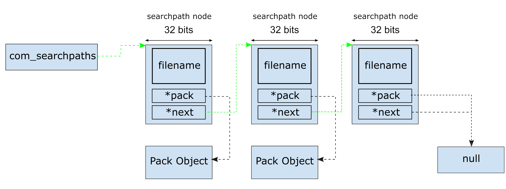
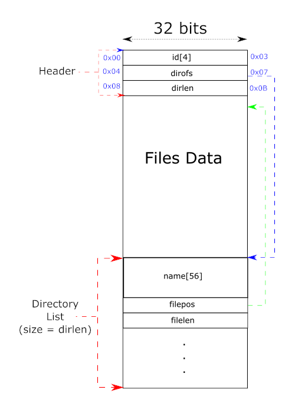

# Notes 003 - PAK Files  
After analyzing Quake memory manager, it is time to read some data and load it into memory. Quake assets are grouped into ```PAK``` files. Due to the naming, I was always under the impression it was compressed, but the is not the case. PAK file has a lot in common with DOOM's WAD file format.  

## Goals  
* Analyze Quake PAK format  
* Search for PAK files   
* Read directory listed in Quake PAK file    

## Searching for PAK files  
Before we can read PAK files, we need to find them first! Quake code starts looking for PAK files as part of the common functionality initialization ```void COM_InitFilesystem(void)```. By default, Quake looks in the current working directory (Current EXE location), but this behavior can be modified by passing ```-basedir``` as a parameter to the EXE.  
By default, the code looks for a sub-folder ```id1```, and the search process for PAK files starts.  

Note: WinQuake supports the official mission pack for Quake, Quake Mission Pack 1, and Quake Mission Pack 2. Both those expansions start same EXE passing ```-hipnotic``` and ```-rogue``` respectively.  

If you notice, there is a naming pattern for the pack folder.  
* Quake, developed by ```id``` Software and released June 22, 1996.  
* Quake Mission Pack 1: Scourge of Armagon, developed by ```Hipnotic``` Software and released on March 5, 1997.  
* Quake Mission Pack 2: Dissolution of Eternity, developed by ```Rogue``` Entertainment and released on March 19, 1997.  

```cpp
   if (COM_CheckParm("-rogue"))
      COM_AddGameDirectory(va("%s/rogue", basedir));
   if (COM_CheckParm("-hipnotic"))
      COM_AddGameDirectory(va("%s/hipnotic", basedir));
```

Once a folder is selected, searching for pack files is accomplished by ```COM_AddGameDirectory``` function found in ```common.c```. The function creates a search linked list with nodes of type ```searchpath_t```.  

```cpp
typedef struct searchpath_s
{
   char filename[MAX_OSPATH]; // PAK files folder (this stores the folder path not the pack file name)
   pack_t* pack; // Pointer to pack file struct
   struct searchpath_s* next; // New pack in linked list
} searchpath_t;
```

Searching for pak files in a folder is accomplished by looking for ```pakX.pak``` where X increments each iteration starting from zero. So, it would look for PAK0.pak, PAK1.pak, PAK2.pak and so on. It would only stop if it can't load the sequenced PAK file. That means you must have the packs numbers in sequence with no gaps in numbering, or else the PAK will not be loaded. With each PAK file found, a new ```searchpath_t``` node is added to the search liked list.  

```cpp
   for (i = 0; ; i++)
   {
      sprintf(pakfile, "%s/pak%i.pak", dir, i);
      pak = COM_LoadPackFile(pakfile);
      if (!pak)
         break;
      ...
   }
```

Visualizing a populated search list in memory  

  

Though all the nodes in the linked list are of type ```searchpath_t``` which are different, a node holding data about a directory, or a node holding data about a PAK file, a directory node is a node that has a ```filename``` set with a directory path and had its ```pack_t*``` pointing to null (last node in the above diagram). A PAK file node has a ```filename``` set to null and ```pack_t*``` pointing to a ```pack_t``` object.  

Note: The use case for this is to look for a file in PAK files, and if not found, it looks in the directory. This is useful for modding a debugging. So if you are testing with new game assets no need to put them in a PAK file; just drop them in the PAK directory.  

The found PAK files have their defining node  

```cpp
typedef struct pack_s
{
   char filename[MAX_OSPATH]; // Pack file name
   int handle;   // Pack file handler
   int numfiles; // Number of files in the pack
   packfile_t* files;  // struct that hold a list (array) of all pack files in the pack
} pack_t;
```

The struct holds basic information that would allow us to access and search the PAK files. This time the ```filename[MAX_OSPATH]``` is populated with the PAK file name and path, but did you notice that the handle to the file is of type int (```int handle;```), normally you would expect a ```FILE*```. This was a nice simple trick to keep Quake portable, and to limit resource usage to ```MAX_HANDLES``` (which is set to 10), remember all OS related functionality is isolated in ```sys_*``` files, ```sys_win.c``` is the one that holds the ```FILE*``` pointer. ```FILE* sys_handles[MAX_HANDLES];``` is an array of handlers to files that Quake opens. The ```int handler``` is just an index into that array (there are few exceptions to this rule).  

Let look at ```packfile_t* files```, this struct holds information about the files that are sored in the PAK file  

```cpp
typedef struct
{
   char name[MAX_QPATH]; // Name of the file
   int filepos, filelen; // The position of the file in the pack, and its length
} packfile_t;
```

visualizing those two struts together  

  

```packfile_t``` stores the name, the position, and length of a file in the pack, so usually, we will need an array of the struct to keep track of all the files in a PAK. This is similar to WADs for DOOM, but one difference is the file names. File names in Quake are big enough to hold folder sub-folder paths, so you would see a name like "sound/misc/enfire.wav".   

Now visualizing the complete picture in memory would look something like this.  

  

This is how the search linked list struct stores files in memory, now let’s have a look at the PAK files them self’s and how they are structured so we can extract the files from them and populate the above search list.  

## Pack File
Pack files are a simple format that groups files in a single big file (similar to DOOMs WAD). As with most formats, PAK files have a header that identifies the file and points to where you can read the directory list.  

The header is formatted like the following.  

```cpp
typedef struct
{
   char id[4]; // Should be "PACK"
   int dirofs; // Offset where file directory list should be read
   int dirlen; // Directory size (directory struct size * number of entries)
} dpackheader_t;
```

After reading the header, we know where the dictionary offset is, and we can extract information about individual files in the PAK; each directory entry in the PAK is structured as following.  

```cpp
typedef struct
{
   char name[56];
   int filepos, filelen;
} dpackfile_t;
```

Note: The dictionary entry in the PAK file (on disk) "name" is 56 bytes, but when Quake loads that into memory, it is copied into 64 bytes.  

Visualizing a PAK file

  

All the loading happens in the ```COM_LoadPackFile``` let me summarize what the function does.  

1. Tries to open the pack file; if failed returns null and search stops  
2. If the file is open, it reads the file header  
3. Validates that the header name is set to "PACK"  
4. Calculate the number of files (dirlen / sizeof dpackfile_t struct)  
5. Check the number of files in PAK (MAX is 2048 files in a single pack)  
6. Check the number of files in pack match official PAK0 (to load modified PAKs you need a registered version)  
   Note: Quake knows the copy is registered by looking for the file ```gfx/pop.lmp``` in the PAK files, ```gfx/pop.lmp``` content must match a hardcoded value.  
7. Allocate memory for the PAK file directory and reads it.  

After all the PAK files are processed, we have an in-memory structure that we can use to search for game files when they are needed.  

## Find Files
Now that we have the PAK files directory in memory let’s have a look at how Quake search for a file in those structures. The function ```int COM_FindFile(char* filename, int* handle, FILE** file)``` which is in ```common.c``` accomplish that and takes three arguments, the first argument is the filename to search for, the argument is an input that must be passed to the function, but the other two arguments are output argument. The caller of the function ```COM_FindFile``` has a choice of passing either a valid handle or a valid file pointer (but not both). Suppose a valid ```int* handle``` is passed; it is populated with the files handler index if the file is found or set to null if the file is not found. If a valid ```FILE** file``` is passed the function, it would "re-open" the pack file and return the new file handler (yes, re-open, since we already have all the pack files open and stored their handlers in ```sys_handles``` array). When the searched files are found its size is returned.   

Note: Opening a file passing a valid ```FILE** file```, is used in demo play. We will investigate that in some other notes.  
 
The main idea is a liner search through each pack file or directory in the search list ```com_searchpaths```.  

```cpp
   ...
   search = com_searchpaths;
   ...
   // Linear search all nodes in the com_searchpaths 
   for (; search; search = search->next)
   {
      // For each pack file
      // Is this a valid pack file?
      if (search->pack)
      {
         pak = search->pack;
         // liner search through all the files that are in the pak
         for (i = 0; i < pak->numfiles; i++)
            if (!strcmp(pak->files[i].name, filename)) // Compare the file with the one we are looking for
            { 
               // found it!
               if (handle)
               {
                  *handle = pak->handle; // Get the handler index for the file
                  Sys_FileSeek(pak->handle, pak->files[i].filepos); // Move the file pointer to that file location
               }
               else
               { 
                  // open a new file instance (don't missup with the existing pack file handler)
                  // This is used for demo replay file
                  *file = fopen(pak->filename, "rb");
                  if (*file)
                     fseek(*file, pak->files[i].filepos, SEEK_SET);
               }
               com_filesize = pak->files[i].filelen;
               return com_filesize;
            }
      }
      else
      {
         // This is a directory node
         // Look for the file in the directory
         ...
      }
   ...
   }
```

Note: From my point of view, this function doesn't play by the rules, passing ```FILE** file``` to the function and calling ```fopen``` and ```fseek``` is out of the "Quake coding style" a helper function should have been created in the ```sys_*.c``` similar to the helper functions ```Sys_FileRead``` and ```Sys_FileSeek```.

Finally, I would like to note that in memory, the search list stores the pack files in reverse order, which means PAK2 will show up in the search list before PAK1, and PAK1 will show before PAK0. This is very important for patching and game mods. If you want to overwrite a file in PAK0, release an updated version in PAK1 and leave PAK0 as is (searching for files is sequential).  

## Coding
The first thing to do is implement searching for PAK files. To simplify things, I will implement "-basedir" parameter passing similar to Quake's implementation. The parameters allow the user to specify a PAK file path (convenient for debugging and molding). The Parameters struct stores the parameters passed to the EXE for us to use later as needed.

```cpp
struct Parameters
{
   std::string  sCurrentWorkingDirectory;
   std::vector<std::string> ArgumentsList;

   void ParseArguments(int iArgumentsCount, char* szArgument[])
   {
      for (size_t i = 0; i < iArgumentsCount; ++i)
      {
         ArgumentsList.push_back(szArgument[i]);
      }
   }

   int FindArgument(const std::string& sArgument)
   {
      int iIndex = -1;
      std::vector<std::string>::iterator itr = std::find(ArgumentsList.begin(), ArgumentsList.end(), sArgument);
      if (itr != ArgumentsList.end())
      {
         iIndex = (int)std::distance(ArgumentsList.begin(), itr);
      }
      return iIndex;
   }
};

```

Create the structures required to hold the data as discusses in the notes

```cpp
#define MAX_PATH_LENGTH 128
#define MAX_PACK_NAME 64 
#define MAX_PACK_NAME_DISK 56

struct PackFile
{
   char szName[MAX_PACK_NAME];
   int32_t iFileOffset;
   int32_t iFileSize;
};

struct Pack
{
   char szFileName[MAX_PATH_LENGTH];
   int32_t iFileHandleIndex;
   int32_t iNumberOfFiles;
   PackFile* pFiles;
};

struct PackFileOnDisk
{
   char szName[MAX_PACK_NAME_DISK];
   int32_t iFileOffset;
   int32_t iFileSize;
};

struct PackHeader
{
   char ID[4];
   int32_t iDirectoryOffset;
   int32_t iDirectoryLength;
};

struct SearchPath
{
   char szPathName[MAX_PATH_LENGTH];
   Pack* pPack;
   SearchPath* pNext;
};
```

Once we have this in place, it is time to populate those structures load the pack file directory. 

```cpp
void Common::AddGameDirectory(std::string sPAKDirectory)
{
   // Allocate memory
   SearchPath* pSearchPath = (SearchPath*)m_pMemorymanager->NewLowEnd(sizeof(SearchPath));
   strcpy(pSearchPath->szPathName, sPAKDirectory.c_str());

   pSearchPath->pNext = m_pHeadSearchList;
   m_pHeadSearchList = pSearchPath;

   // Keep searching until we don't find any more pack files
   int iFileNumber = 0;
   while (true)
   {
      string sPakFileName = sPAKDirectory + "/pak" + to_string(iFileNumber) + ".pak";

      // Try to load the pak file
      Pack* pPack = LoadPackFile(sPakFileName);

      // Where we able to load it?
      if (!pPack)
         break;

      // Add it to the search list
      pSearchPath = (SearchPath*)m_pMemorymanager->NewLowEnd(sizeof(SearchPath));
      pSearchPath->pPack = pPack;
      pSearchPath->pNext = m_pHeadSearchList;
      m_pHeadSearchList = pSearchPath;

      iFileNumber++;
   }
}

Pack* Common::LoadPackFile(string& sPackFileName)
{
   // Try to open the file, and return a valid index (index to handler array)
   int32_t iPAKFileHandleIndex = m_pSystem->OpenFile(sPackFileName);

   if (iPAKFileHandleIndex < 0)
   {
      return nullptr;
   }

   PackHeader header;
   // Read Pack header
   m_pSystem->FileRead(iPAKFileHandleIndex, &header, sizeof(PackHeader), 1);

   //Validate PAK file header
   if (header.ID[0] != 'P' && header.ID[1] != 'A' && header.ID[2] != 'C' && header.ID[3] != 'K')
   {
      return nullptr;
   }

   // Calculate the number of files
   int iFilesCount = header.iDirectoryLength / sizeof(PackFileOnDisk);

   // I don't feel okay putting a 2048 or size PackFileOnDisk on stack
   PackFileOnDisk* pPackFileOnDisk = new PackFileOnDisk[2048];

   // Allocate memory for the file directory array
   PackFile* pFiles = (PackFile*)m_pMemorymanager->NewLowEndNamed(iFilesCount * sizeof(PackFile), sHunkPackFiles);
   m_pSystem->FileSeek(iPAKFileHandleIndex, header.iDirectoryOffset);
   m_pSystem->FileRead(iPAKFileHandleIndex, pPackFileOnDisk, header.iDirectoryLength, 1);

   // Copy the needed data
   for (int i = 0; i < iFilesCount; i++)
   {
      strcpy(pFiles[i].szName, pPackFileOnDisk[i].szName);
      pFiles[i].iFileOffset = pPackFileOnDisk[i].iFileOffset;
      pFiles[i].iFileSize = pPackFileOnDisk[i].iFileSize;
   }

   Pack* pPack = (Pack*)m_pMemorymanager->NewLowEnd(sizeof(Pack));
   strcpy(pPack->szFileName, sPackFileName.c_str());
   pPack->iFileHandleIndex = iPAKFileHandleIndex;
   pPack->iNumberOfFiles = iFilesCount;
   pPack->pFiles = pFiles;

   return pPack;
}

```

Make sure we update the common initialization function to call ```AddGameDirectory```

```cpp
void Common::InitGameFiles(Parameters* pParameters)
{
   string sPAKDirectory = pParameters->sCurrentWorkingDirectory;

   // Did the EXE get a specific Pack folder to look into?
   int iArgumentIndex = pParameters->FindArgument(PARAM_BASE_DIR);
   if (iArgumentIndex > 0)
   {
      sPAKDirectory = pParameters->ArgumentsList[iArgumentIndex + 1];
   }

   AddGameDirectory(sPAKDirectory + "/" + QUAKE_ASSET_FOLDER);
}
```

Now let’s implement a function to go through the populated list and print all the files to the console. 

```cpp
void Common::TEMP_PrintListAllFiles()
{
   SearchPath* pCurrent = m_pHeadSearchList;

   // Loop through all PAKs
   while (pCurrent) 
   {
      if (!pCurrent->pPack)
      {
         break;
      }

      std::cout << pCurrent->pPack->szFileName << std::endl;

      // Loop through all the files in the PAK file
      for (size_t i = 0; i < pCurrent->pPack->iNumberOfFiles; i++)
      {
         std::cout << "[" << i << "] " << pCurrent->pPack->pFiles[i].szName << std::endl;
      }

      // Move to the next pak file
      pCurrent = pCurrent->pNext;
   }
}
```
I have also implemented a trimmed version of ```FindFiles``` to be used later.

Now, if you got everything right and updated the main function to call the initialization functions, you should see something like this!

  

That is not bad; next, we need to read some data from the PAK file and see if we can use it.
