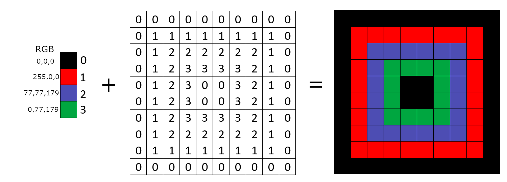
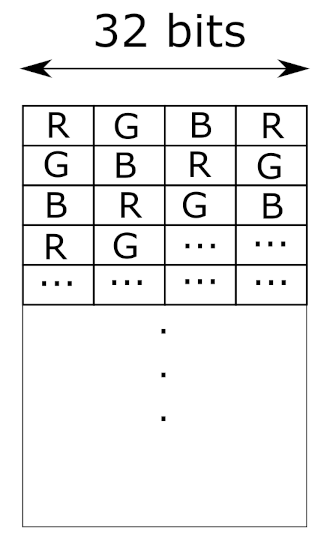
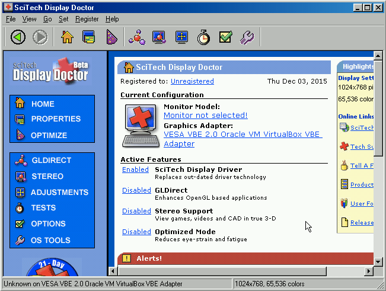
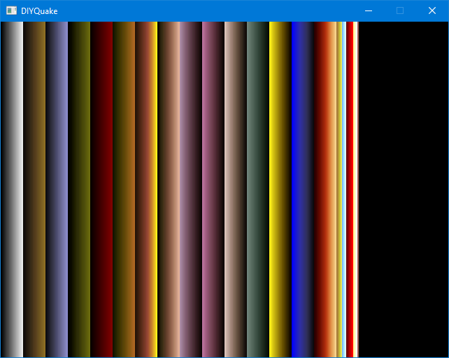
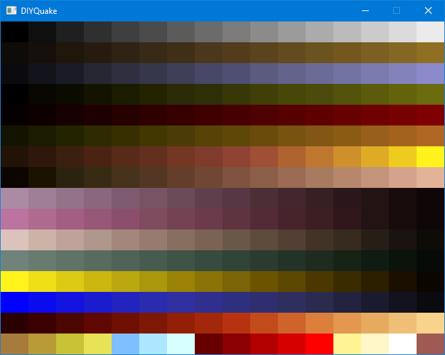

# Notes 004 - Color Palette
So far, we were able to read the PAK file directory and now it is time to read and load a file. It would be a good start to read the color palette file, but what is a palette file? And what is it used for?  

## The Palette  
In old days memory was a major factor on how games/applications are designed, systems where very limited with few MB of RAM. So, developers would cut memory consumption as much as possible to get their application running, and Quake was no exception. In games a lot of space (Memory/HDD) is consumed by the assets of the game. For an example, a texture (image) that is 640 pixels wide and 480 height making the total number of pixels in the image 307200 pixel, each pixel is represented in 3 colors, red, green, and blue with each color ranging from 0 to 255, we will need one byte per color making a total of 3 bytes for each pixel (3 x 8 = 24bit color depth). If you do the math 640 x 480 x 3 = 921600 = 900kb, that is a huge amount of memory. Here is a comparison table of different resolutions with multiple "color depth" configurations to have an idea how much memory is consumed.  

| Resolution | Color Depth | Required memory |
| ---------- | ----------- | --------------- |
| 640*480 | 8-bit | 300 kb |
| 640*480 | 16-bit | 600 kb | 
| 640*480 | 24-bit | 900 kb |
| 640*480 | 32-bit | 1200 kb |
| 800*600 | 8-bit | 469 kb |
| 800*600 | 16-bit | 937 kb |
| 800*600 | 24-bit | 1,37 MB |
| 800*600 | 32-bit | 1,83 MB |
| 1024*768 | 8-bit | 768 kb |
| 1024*768 | 16-bit | 1,5 MB |
| 1024*768 | 24-bit | 2,25 MB |
| 1024*768 | 32-bit | 3 MB |
| 1280*1024 | 8-bit | 1,25 MB |
| 1280*1024 | 16-bit | 2,5 MB |
| 1280*1024 | 24-bit | 3,75 MB |
| 1280*1024 | 32-bit | 5 MB |

(__Note:__ Size in memory/storage is not the only problem, one other issue you would face can you update the texture in time to achieve target FPS, more data to copy means more time is needed, and one possible solution to save some memory is to lower the number of bytes (color depth) that will define the pixels colors.  

Quake decided to go with 8-bit color depth. 8-bits will give us a total of 256 colors, but which colors exactly? 8-bits cannot be split evenly between red, green and blue, one possible combination 3 bits Red, 3 bits Green, 2 bits Blue, no matter however you split the bits there will be a color that has a smaller number of bits than others. What about if I want only shades of Red in my colors and not green or blue? Using the 8-bits to address colors is very limiting and troublesome.  

Palette comes in to solve such a problem, the palette is an indirect level of color selection, it is a simple lookup table where each color represented in RGB (24 bits) is given a unique id. This lets us choose any 256 colors we like. And when texture is generated, we just use the id of the color instead of the 24 bits.  

Here is a simplified visualization of a 2-bit palette (possible values in binary 00, 01, 10, 11).  

   

Since the 8-bit color depth it will be possible to unique id 256 colors.  
In Quake textures and images use a predefined palette file that could be found in the pack file. The palette loading process is part of the Host initialization.  

``` cpp
void Host_Init (quakeparms_t *parms)
{
    ...
    host_basepal = (byte *)COM_LoadHunkFile ("gfx/palette.lmp"); // Load the color palette
    ...
    VID_Init (host_basepal); // Initialize the video.
    ...
}
```

The ```COM_LoadHunkFile``` function is just calls ```COM_LoadFile``` function passing both the palette file path and a ```1```.  

``` cpp
byte *COM_LoadHunkFile (char *path)
{
    return COM_LoadFile (path, 1);
}
```

Let’s have a closer look at the ```COM_LoadFile``` function and understand what does the ```1``` mean.  

``` cpp
byte *COM_LoadFile (char *path, int usehunk)
{
    ...
    // Search for the file in the pack files (Notes003)
    len = COM_OpenFile (path, &h);
    if (h == -1) // Not found
        return NULL;
    
    
    COM_FileBase (path, base); // Simple function to extract the file (removes file extension and path)
    
    // Based on the number passed it selects which memory area should this file be loaded
    if (usehunk == 1)
        buf = Hunk_AllocName (len+1, base); // use hunk area
    else if (usehunk == 2)
        buf = Hunk_TempAlloc (len+1); // use temp area
    else if (usehunk == 0)
        buf = Z_Malloc (len+1); // use zone area
    else if (usehunk == 3)
        buf = Cache_Alloc (loadcache, len+1, base); // use cache area
    else if (usehunk == 4)
    {
        if (len+1 > loadsize)
            buf = Hunk_TempAlloc (len+1);
        else
            buf = loadbuf; // user loadbuf variable
    }
    else
        Sys_Error ("COM_LoadFile: bad usehunk");

    if (!buf)
        Sys_Error ("COM_LoadFile: not enough space for %s", path);
        
    ((byte *)buf)[len] = 0;

    Draw_BeginDisc (); // Draws load image.  
    Sys_FileRead (h, buf, len); // Read the file in the selected memory area.
    COM_CloseFile (h); // close the file.
    Draw_EndDisc (); // Draw end loading image

    return buf; // return the loaded file in memory.
}
```
So based on the int being passed a different section of hunk memory will be used.  

The palette file format is simple, just a sequence of bytes, 24-bits for each color in the palette, broken down to a byte each for red, green, and blue, and each color id is the index as it show in the file.

  

At this point we have the file loaded, but we have not created or can draw any thing on the screen yet! Let us have a look at how the main game window is created and how pixels are drawn on the screen.  

## Video
All the video buffer and game window creation functionality are in ```vid_win.c```. The video sub-system is an OS dependent, so it is isolated in ```_win.c``` file. Remember in Notes000 when we had to link with ```MGLLT.LIB```, it is time to explain what that library does and how it is used in Quake.  

__Note:__ This sub-system will be replaced with SDL, more details later.  

MegaGraph Graphics Library or MGL in short is a graphics library created by [SciTech Software](https://web.archive.org/web/19961114152931/http://www.scitechsoft.com/). SciTech was a very well know company in the 90s for ```SciTech Display Doctor```  

  

SciTech Display Doctor is still used by enthusiast who want to run Windows 9x in a virtual machine.  

SciTech Software also released a [developer tools](https://web.archive.org/web/19961114153004/http://www.scitechsoft.com/devprod.html). One of those tools was a C++ graphics library MGL. MGL was released for both Windows and DOS. The library gave its users the power to create windows, extract info from the installed display adapter, draw primitive shapes, access to display buffer and a lot more!  

With all what the library offers Quake doesn't utilize much of those fancy features, Quake used MGL as an interface with the display adapter and didn't use any of the shape drawing functionality in MGL.  

__Note:__ You can find a copy of MGL v1.1 under ```misc\docs\mgl11.zip```  (Quake used version 1.29)  
__Note:__ DOS version of Quake did not use MGL.  
__Note:__ MGL license costs $99 back then in 1996.  

Let us have a closer look of how the video sub-system works and utilizes MGL.  

Video initializations start when ```VID_Init``` is called as part of host initialization.  

``` cpp
void    VID_Init (unsigned char *palette)
{
    ...
    Cvar_RegisterVariable (&vid_mode); // Set some variables values.
    Cvar_RegisterVariable (&vid_wait);
    Cvar_RegisterVariable (&vid_nopageflip);
    Cvar_RegisterVariable (&_vid_wait_override);
    ...
    ...
    Cmd_AddCommand ("vid_testmode", VID_TestMode_f); // register display functions that can be called from game console commands.
    Cmd_AddCommand ("vid_nummodes", VID_NumModes_f);
    Cmd_AddCommand ("vid_describecurrentmode", VID_DescribeCurrentMode_f);
    ...
    ...
    //         DIB = Display interface board
    VID_InitMGLDIB (global_hInstance); // Basic initialization from MGL lib 
    // and populates an array of vmode_t structs to support 320x240, 640x480, 800x600 resolutions
    
    ...
    if (!dibonly) // Did user force direct hardware access video modes? If not use MGL 
        VID_InitMGLFull (global_hInstance); 

    ...
    {
        VID_InitFullDIB (global_hInstance); // More display initialization and information using Windows APIs.
    }
    
    ...
    VID_SetMode (MODE_WINDOWED, palette); // This function sets the palette by calling VID_SetPalette function and calls. 
    // helper functions to create a video hunk, and initialize the frame buffer pointers
    ...

    VID_SetPalette (palette); // I think this is a bug in the code, this function was already called in VID_SetMode
    // I did not see a good reason calling it at this point in the code, I commented this line out and didn't 
    // see any side effects.
    ...
```

Most of those initialization functions update the global struct variable ```vid```  

``` cpp
viddef_t    vid;                // global video state
```

```viddef_t``` holds the information needed to be able to draw on the video buffer, here is a closer look at the struct and what data it holds.  

``` cpp
typedef struct
{
    pixel_t            *buffer;        // pointer frame buffer
    pixel_t            *colormap;      // 256 * 64 Shades (lighting lookup later notes) 
    unsigned short     *colormap16;    // 256 * 64 Shades (lighting lookup later notes) 
    int                fullbright;     // Index of first full bright color
    unsigned           rowbytes;       // may be > width if displayed in a window
    unsigned           width;          // window width
    unsigned           height;         // window height
    float              aspect;         // width / height -- < 0 is taller than wide
    int                numpages;       // number of buffers (double, triple buffers)
    int                recalc_refdef;  // if true, recalc vid-based stuff
    pixel_t            *conbuffer;     // pointer to frame buffer but for console use
    int                conrowbytes;    // console row bytes
    unsigned           conwidth;       // console width
    unsigned           conheight;      // console height
    int                maxwarpwidth;    
    int                maxwarpheight;
    pixel_t            *direct;        // direct drawing to frame buffer
} viddef_t;

```
__Note:__ there is a total of three pointers in the ```viddef_t``` struct that point to the frame buffer, though they are all pointing to the same buffer, they are used within different sub systems.  

* __vid.buffer:__ main frame buffer  
* __vid.conbuffer:__ used by console sub-system  
* __vid.direct:__ used to draw images directly to buffer, like loading image  

Those pointers get initialized depending on your multiple settings (eg. Full screen or windowed mode), but one spot where they get initialized is when calling ```VID_SetMode``` which in turn called ```VID_SetWindowedMode()``` which does that initialization of all tree pointers.  

``` cpp
vid.buffer = vid.conbuffer = vid.direct = dibdc->surface;
```

We have just scratched how the video sub-system work, there is a lot more going on, but that is enough for us to replace the system with SDL.  

__Note:__ MGL lib will can utilize double and triple buffer if the display adopter supports it Triple buffer can be disable by passing ```-notriplebuf``` to the EXE.  

## Goals
* Read the palette file.  
* Add a Video class and create game window.  
* Draw the palette to screen.  

## Coding
First thing to implement is the load function smiler to ```byte *COM_LoadFile (char *path, int usehunk)```, but instead of passing and integer as a indicator which part of the hunk to use, I will be replacing it with an enum.  

``` cpp
enum class LOAD_MEMORY 
{ 
    HUNK_ZONE,
    HUNK_NAMED,
    HUNK_TEMP,
    HUNK_CACHE,
    HUNK_TEMP_STACK
};
```

After implementing the load function, it is time to start implementing a video class that would create a window and a screen buffer to draw on.  

``` cpp
void Video::Init(byte_t* pPalette)
{
   m_iWidth = SCREEN_WIDTH;
   m_iHeight = SCREEN_HEIGHT;

   // Create the main game window
   m_pWindow = SDL_CreateWindow("DIYQuake", SDL_WINDOWPOS_CENTERED, SDL_WINDOWPOS_CENTERED, m_iWidth, m_iHeight, SDL_WINDOW_SHOWN);
   if (m_pWindow == nullptr)
   {
      return;
   }

   // Get the main window surface so we can draw directly to the screen   
   m_pWindowSurface = SDL_GetWindowSurface(m_pWindow);
   if (m_pWindowSurface == nullptr)
   {
      return;
   }

   // Create 8-bit screen buffer 
   m_pScreenBuffer = SDL_CreateRGBSurface(SDL_SWSURFACE, m_iWidth, m_iHeight, 8, 0, 0, 0, 0);
   if (m_pScreenBuffer == nullptr)
   {
      return;
   }

   // Just fill the screen buffers with 0
   SDL_FillRect(m_pScreenBuffer, NULL, 0);

   // Store the pointers so we can use them later
   m_pFrameBuffer = (byte_t*)m_pScreenBuffer->pixels;
   m_pFrameBufferDirect = (byte_t*)m_pScreenBuffer->pixels;
   m_pFrameBufferConsole = (byte_t*)m_pScreenBuffer->pixels;

   // Call helper function to set the palette with the one we just loaded it
   SetPalette(pPalette);
}
```

A helper function is needed to convert the palette to a format that SDL can understands, a color in SDL is represented in the ```SDL_Color``` struct with has variables ```r, g, b``` for red, green and blue.  

``` cpp
void Video::SetPalette(byte_t* pPalette)
{
   // Make sure there was no other palette loaded
   if (m_pPalette)
   {
      delete[] m_pPalette;
   }

   // Create a palette array
   m_pPalette = new SDL_Color[PALETTE_SIZE];

   // Just convert the numbers we loaded from Quake palette to a SDL_Color
   for (int i = 0; i < PALETTE_SIZE; ++i)
   {
      m_pPalette[i].r = *pPalette++;
      m_pPalette[i].g = *pPalette++;
      m_pPalette[i].b = *pPalette++;
   }

   // now set our screen buffer with the palette we just created
   SDL_SetPaletteColors(m_pScreenBuffer->format->palette, m_pPalette, 0, PALETTE_SIZE);
}
```

Now that we got the window, we need to handle events that get sent to the window, we will just handle closing the window for now.  

``` cpp
void System::GetKeyEvents()
{
   SDL_Event event;
   while (SDL_PollEvent(&event))
   {
      switch (event.type)
      {

      case SDL_QUIT:
         Quit();
         break;
      }

   }
}
```

One more thing before we are done with video sub-system, I added the update function (we will not be using it for now but since we are here), Quake updates areas of the screen, sometimes the full screen sometimes a just a specific rects on the screen. Quake sends the function ```void   VID_Update (vrect_t *rects)``` a linked list of rects to update. The rect struct looks like this.  

``` cpp
typedef struct vrect_s
{
   int x,y,width,height;
   struct vrect_s *pnext;
} vrect_t;
```

Though we need to create a similar structure ```UpdateRect``` to use in DIYQuake, this structure is not usable by SDL and need to be converted to a ```SDL_Rect``` that SDL can understand.  

``` cpp
void Video::Update(UpdateRect* pRectsList)
{

   std::vector<SDL_Rect> vRects;
   UpdateRect* pCurrentRect = pRectsList;
   SDL_Rect vConvertRect;
   // go though each rect sent and convert it to a SDL_Rect
   while (pRectsList)
   {
      vConvertRect.x = pRectsList->iX;
      vConvertRect.y = pRectsList->iY;
      vConvertRect.w = pRectsList->iWidth;
      vConvertRect.h = pRectsList->iHeight;

      vRects.push_back(vConvertRect);
      pRectsList = pRectsList->pNext;
   }

   // Validate we have a buffer to draw to
   if (m_pScreenBuffer == nullptr || m_pWindowSurface == nullptr)
   {
      return;
   }

   // Update all rect to the screen
   for (SDL_Rect& vRect : vRects)
   {
      SDL_BlitSurface(m_pScreenBuffer, &vRect, m_pWindowSurface, &vRect);
   }

   // Ask the windows to draw itself
   SDL_UpdateWindowSurface(m_pWindow);
}

```

Now that we are done with basic video functionality that we need for now, it is time to add few functions to draw something to the screen. The ```screen.c``` in Quake draws miscellanies stuff to the screen menu pause, status bar, console, chat, notify, etc. It might be a good spot to draw the palette there for now.  

``` cpp
class Screen
{
public:
   Screen();
   void Init(Video* pVideo);
   void UpdateScreen();

   void TEMP_DrawPalette();
   void TEMP_DrawPalette2();

protected:
   Video* m_pVideo;
};
```

I have created two different functions to draw the palette, first function would just draw each color as two pixels in width and full screen height.  

``` cpp
void Screen::TEMP_DrawPalette()
{
   byte_t* pScreenBuffer = m_pVideo->GetFrameBuffer();
   for (int i = 0; i < 256; ++i)
   {
      for (int j = 0; j < m_pVideo->GetHeight(); ++j)
      {
         pScreenBuffer[j * m_pVideo->GetWidth() + i * 2] = i;
         pScreenBuffer[j * m_pVideo->GetWidth() + i * 2 + 1] = i;
      }
   }
}
```

The second function splits the screen evenly to draw each color as a square/rectangle.  

``` cpp
void Screen::TEMP_DrawPalette2()
{
   int PaletteWidth = m_pVideo->GetWidth() / 16;
   int PaletteHight = m_pVideo->GetHeight() / 16;

   byte_t* pScreenBuffer = m_pVideo->GetFrameBuffer();

   for (int X = 0; X < m_pVideo->GetWidth(); ++X)
   {
      for (int Y = 0; Y < m_pVideo->GetHeight(); ++Y)
      {
         pScreenBuffer[Y * m_pVideo->GetWidth() + X] = (Y / PaletteHight) * 16 + (X / PaletteWidth);
      }
   }
}
```

Call one of those functions to be drawn on update.  

``` cpp
void Screen::UpdateScreen()
{
   //TEMP_DrawPalette();
   TEMP_DrawPalette2();

   UpdateRect rect{ 0, 0, m_pVideo->GetWidth(), m_pVideo->GetHeight() };
   m_pVideo->Update(&rect);
}
```

Now let’s implement a game main loop, but before we do that, we need to create a function to limit the frame rate to 72 frames to match what Quake does  

``` cpp
void Host::Frame(float fTime)
{
   if (!FilterTime(fTime))
      return;

   m_pSystem->GetKeyEvents();

   m_Screen.UpdateScreen();
}

bool Host::FilterTime(float fTime)
{
   dRealTime += fTime; // Keep track for the time

   // TODO: this needed an update when implementing demo play
   if (dRealTime - dOldrealTime < 1.0 / 72.0) // 72 framerate per second
      return false;

   dFrametime = dRealTime - dOldrealTime;
   dOldrealTime = dRealTime;

   // Clamp value between 0.1 and 0.001
   if (dFrametime > 0.1)
      dFrametime = 0.1;
   if (dFrametime < 0.001)
      dFrametime = 0.001;
   return true;
}
```

Finally let’s add the game loop and run.  

``` cpp
   uint64_t OldTime, NewTime;
   double dTime;
   OldTime = system.GetTime();

   while (system.GetIsRunning())
   {
      NewTime = system.GetTime();
      dTime = (double)(NewTime - OldTime) / system.GetPerformanceFrequency();
      host.Frame(dTime);
      OldTime = NewTime;
   }
```

First function that draws the color as 2 pixels.  



Function that drawn each color as a square/rect.  



Now that we can draw to the screen, lets move one to try and draw something more interesting!  
