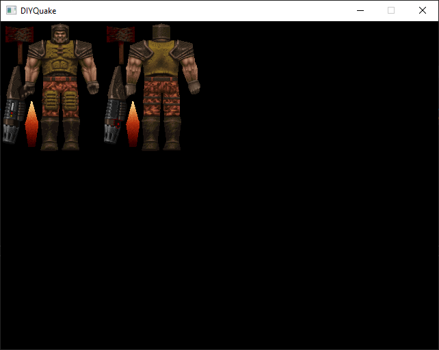

Contributors: [fluke](https://twitter.com/flukejones)  

# Notes 005 - Alias Models Skin  
Now that we have created a window to read and load the color palette, it is time to draw something on the screen. What is better than drawing Quake Ranger's skin (Quake main character texture)? But before we can do that, we have to understand models and how MDL files are formatted.  

## Goals
* Understand what models are and their types is
* MDL file format
* How is an alias model skin loading
* Code!

## Models  
In computer graphics, the word "Model" usually refers to representing a 3D object, and this is how Quake uses the term. Quake comes with three main types of models.  

* Alias Model: Characters, enemies, weapons, and some pickups.  
* Brush Model: Map / Level.  
* Sprite Model: Effects like explosion particles, fire, etc. (those are 2D, not 3D).  

For now, we will focus on Alias Models.  

# Alias Model  
Alias models store data for the player character, enemies characters, and some pickups. The name "Alias" comes from the 3D modeling application [Alias PowerAnimator](https://en.wikipedia.org/wiki/PowerAnimator), which was used to create the models.  

Note: I found an interesting thread about [Alias PowerAnimator v6.0 or v7.0](https://forums.irixnet.org/thread-128.html); ~~it seems that [Fabien Sanglard](https://fabiensanglard.net/) is writing a book about Quake, which is super good news! The thread has few images that might show in the book. The post is dated 2019 that makes me think that the book should be released soon.~~  
Update: Fabien Sanglard confirms no Quake book schedueld


Alias Models can be found in PAK files with MDL extension. The file format is simple. MDL has a header and data sections. Most of the model handling functionality can be found in the [model.c](../../Notes000/src/WinQuake/WinQuake/model.c). At any point in time, Quake can only keep track of up to 256 models and tracks them with an array variable [mod_known](../../Notes000/src/WinQuake/WinQuake/model.c#L39).  

``` cpp
#define MAX_MOD_KNOWN   256
model_t mod_known[MAX_MOD_KNOWN];
```

The model header definition is defined by the struct ```mdl_t```  

``` cpp
typedef struct {
   int     ident;         // identifier
   int     version;       // version 6 
   vec3_t  scale;         // x, y, z scale factor
   vec3_t  scale_origin;  // x, y , z point that define center or the model
   float   boundingradius;// Radius of the model
   vec3_t  eyeposition;   // Model eye position
   int     numskins;      // Number of skins the model has
   int     skinwidth;     // Skin / Texture width 
   int     skinheight;    // Skin / Texture height 
   int     numverts;      // number of vertices
   int     numtris;       // number of triangles
   int     numframes;     // number of animation frames
   synctype_t synctype;   // animation synchronization (Sync / Random)
   int     flags;         // ???
   float   size;          // ???
} mdl_t;
```

And the data sections are
* A list of skins "textures": that describes the colors of the skin or whatever it can be wearing.
* A list of skin vertices: the position of vertices on the skin texture to be mapped on the 3D model.
* A list of triangles: the describe the shape of the model in 3D space.
* A list of animation frames: that describes an animation for the model

It is a good idea to visualize how the MDL file is formatted. It will simplify reading the code.  

 

There is a lot of fields in the header. However, we don't have to understand all of them yet, and we will focus on one related to model skin.  

First things first! The first 4 bytes in the header is the identifier, which can identify that model type. For Alias Models, it should be 'IDPO' (which stands for id polygon). Those 4 bytes can be interpreted as four characters or as a single 32bit integer. Quake code converts those 4 bytes to an int and compares them to an int.   

``` cpp
#define IDPOLYHEADER    (('O'<<24)+('P'<<16)+('D'<<8)+'I')
// (('O'<<24)+('P'<<16)+('D'<<8)+'I') == (char*) "IDPO" == (int) 1229213775 == (hex) 0x4944504f
```

If you wonder if there is any benefit of casting the ```ident``` to an int, the answer is yes! Let's look at the generated assembly code, comparing it as char[4] and an int  

First, let's look at comparing each byte as a char.  

  


Now, let's re-write this to compare the same values but just casting it to an int.  

  

Casting to int has only a single comparison call to know if the value matches what we are looking for, while the char array versions need four comparisons to check for a match.

Before we jump into the code, let's talk a little about the Model skin! The model is just a texture; if you are new to computer graphics, a ```texture``` is just an image that we apply on a 3D model to give it more details and a more realistic look. The process of applying / mapping this image to a model is called [texture mapping](https://en.wikipedia.org/wiki/Texture_mapping). We will talk about that in detail in a later note.

If you have a hard time understanding or visualizing how a 2D image gets mapped to a 3D model, here are great examples that would help!

  
Image Credit: Wikipedia

Are you still having a hard time digesting the concept? There is even a better example I found on Twitter!


Now that we have a basic understanding of what model skin is and its use let's try to extract it.

As previously discussed Quake is a Client/Server architecture. The server sends a request to the client with the model name to load, and the client loads the model. The model loading process starts by calling the function [Mod_ForName](../../Notes000/src/WinQuake/WinQuake/model.c#L329) passing the name of the model that should be loaded.

The function [Mod_LoadModel](../../Notes000/src/WinQuake/WinQuake/model.c#L256) is a helper function, that would do few things. At this point, the code doesn't know which type of model we are trying to load, So the first step that is done is loading the file in temp memory.  

Note: if the model is small and can fit in a [1KB of stack memory](../../Notes000/src/WinQuake/WinQuake/model.c#L259), the stack is used to reduce fragmentation. But usually, models that are more than 1K in size are loaded from the pack file to the temp memory area. No! the model is not loaded to the cache area yet! Instead, the complete model file is loaded to the temp memory, which is how it is in the pak file. 

Now that we have [model loaded](../../Notes000/src/WinQuake/WinQuake/model.c#L282), it is time to look at the model header and extract the data we need.

Before we move on, there is a small detail, the data type ```qboolean``` is just an enum that can be true or false.  

``` cpp
typedef enum { false, true }    qboolean;
```

You might wonder why they didn't just use ```bool``` data type in the world? Why the new data type? The truth is in [C89/90](https://en.wikipedia.org/wiki/ANSI_C), bool was not a standard data type, and it was introduced in C99 (1999), a few years later after Quake release.     

``` cpp
model_t *Mod_LoadModel (model_t *mod, qboolean crash)
{
   ...
   //
   // load the model file to temp / stack memory 
   //
   buf = (unsigned *)COM_LoadStackFile (mod->name, stackbuf, sizeof(stackbuf));
   if (!buf)
   {
      if (crash)
         Sys_Error ("Mod_NumForName: %s not found", mod->name);
      return NULL;
   }
   
   //
   // extract the file name (remove extension), the name to be used as hunk name
   //
   COM_FileBase (mod->name, loadname);
   
   ...

   // Call the Model loading function base on the header information
   mod->needload = NL_PRESENT;

   // 3 possible models types 
   switch (LittleLong(*(unsigned *)buf))
   {
   case IDPOLYHEADER: // "IDPO"  (id polygon)
      Mod_LoadAliasModel (mod, buf);
      break;
      
   case IDSPRITEHEADER: // "IDSP" (id sprite) 
      Mod_LoadSpriteModel (mod, buf);
      break;
   
   default: // Any thing else has to be a bsp map
      Mod_LoadBrushModel (mod, buf);
      break;
   }

   return mod;
}
```

Now lets shift focus to [Mod_LoadAliasModel](../../Notes000/src/WinQuake/WinQuake/model.c#L1442) and see how Alias Model skin are loading. 

Here is an overview of what the code will do
* ```buffer``` that is passed to the function in the loaded MDL file in temp memory.
* Read the hunk memory address (to track how much memory will be used)
* Allocate memory on the hunk for the model (Yes, hunk! not cache)
   * A new header is counted for ```aliashdr_t```
* Read header, and calculate how big the data sections
* Load the needed data into the hunk memory
* reread the address of the hunk (hunk end - hunk start = hunk used)
* Now copy all that to the cache area!
* Free the hunk!

You don't have to understand everything yet; try to focus on the skin part of the model.

```cpp
void Mod_LoadAliasModel (model_t *mod, void *buffer)
{
   int           i;
   mdl_t         *pmodel, *pinmodel;
   stvert_t      *pstverts, *pinstverts;
   aliashdr_t    pheader; // New header is created to track where is data in memory
   mtriangle_t   *ptri;
   dtriangle_t   *pintriangles;
   int           version, numframes, numskins;
   int           size;
   daliasframetype_t *pframetype;
   daliasskintype_t  *pskintype;
   maliasskindesc_t  *pskindesc;
   int               skinsize;
   int               start, end, total;
   
   // Read the starting memory, so later we know who much of the hunk was used
   start = Hunk_LowMark ();

   // Cast the data in the temp memory buffer to mdl_t (MDL header)
   pinmodel = (mdl_t *)buffer;

   // Read the model version from
   version = LittleLong (pinmodel->version);
   // Is the model version what is expected? versions 6 (#define ALIAS_VERSION   6)
   if (version != ALIAS_VERSION)
      Sys_Error ("%s has wrong version number (%i should be %i)",
             mod->name, version, ALIAS_VERSION);

   //
   // allocate space for a working header, plus all the data except the frames,
   // skin and group info
   //
   size =   sizeof (aliashdr_t) + (LittleLong (pinmodel->numframes) - 1) *
          sizeof (pheader->frames[0]) +
         sizeof (mdl_t) +
         LittleLong (pinmodel->numverts) * sizeof (stvert_t) +
         LittleLong (pinmodel->numtris) * sizeof (mtriangle_t);

   // Allocate the memory needed on the hunk
   pheader = Hunk_AllocName (size, loadname);

   // Move pointer to the right spot in the allocated memory
   pmodel = (mdl_t *) ((byte *)&pheader[1] +
         (LittleLong (pinmodel->numframes) - 1) *
          sizeof (pheader->frames[0]));
   
   mod->flags = LittleLong (pinmodel->flags);

   // copy model data to the new memory, boundaries, number of skins
   // skin width and skin height
   pmodel->boundingradius = LittleFloat (pinmodel->boundingradius);
   pmodel->numskins = LittleLong (pinmodel->numskins);
   pmodel->skinwidth = LittleLong (pinmodel->skinwidth);
   pmodel->skinheight = LittleLong (pinmodel->skinheight);

   ...

   // number of skins in the model
   numskins = pmodel->numskins;

   // How are is the model data?
   pheader->model = (byte *)pmodel - (byte *)pheader;

   //
   // calculate the size of the skin (texture)
   //
   skinsize = pmodel->skinheight * pmodel->skinwidth;

   // now that we know the size of the texture multiply that with the number of 
   // skins for this model to get the total size of memory to be allocated
   // (allocate on hunk)
   pskindesc = Hunk_AllocName (numskins * sizeof (maliasskindesc_t),
                        loadname);

   // store how far in memory is the skin stored
   pheader->skindesc = (byte *)pskindesc - (byte *)pheader;

   // Now iterate  
   for (i=0 ; i<numskins ; i++)
   {
      aliasskintype_t   skintype;

      skintype = LittleLong (pskintype->type);
      pskindesc[i].type = skintype;

      if (skintype == ALIAS_SKIN_SINGLE)
      {
         pskintype = (daliasskintype_t *)
               Mod_LoadAliasSkin (pskintype + 1,
                              &pskindesc[i].skin,
                              skinsize, pheader);
      }
      else
      {
         pskintype = (daliasskintype_t *)
               Mod_LoadAliasSkinGroup (pskintype + 1,
                                 &pskindesc[i].skin,
                                 skinsize, pheader);
      }
   }
 

    // Skip the other data blocks for now
   
   
   // Now that everything is allocated on the hunk area, time to read it and move it to cache!
   // move the complete, relocatable alias model to the cache
   //   
   end = Hunk_LowMark ();
   // how much memory was used?
   total = end - start;
   
   // Allocate the total size in cache area 
   Cache_Alloc (&mod->cache, total, loadname);
   if (!mod->cache.data)
      return;

   // copy to cache   
   memcpy (mod->cache.data, pheader, total);

   // free the hunk as if nothing has happened!
   Hunk_FreeToLowMark (start);
}

```

There is two types of sking ```ALIAS_SKIN_SINGLE``` and ```ALIAS_SKIN_GROUP```. We will focus on ```ALIAS_SKIN_SINGLE```, we will skip ```ALIAS_SKIN_GROUP``` for now.

Now let's have a look at the ```Mod_LoadAliasSkin```

``` cpp
void * Mod_LoadAliasSkin (void * pin, int *pskinindex, int skinsize, aliashdr_t *pheader)
{
    int     i;
    byte    *pskin, *pinskin;
    unsigned short  *pusskin;

    // Allocate hunk memory for the model skin
    pskin = Hunk_AllocName (skinsize * r_pixbytes, loadname);
    pinskin = (byte *)pin;
    *pskinindex = (byte *)pskin - (byte *)pheader;

    // copy the skin from the loaded file in temp memory to the hunk allocated
    // r_pixbytes (bytes per pixel) in software renderer = 1
    if (r_pixbytes == 1)
    {
        // copy the texture
        Q_memcpy (pskin, pinskin, skinsize);
    }
    else if (r_pixbytes == 2) // OpenGL stuff, ignore!
    {
        
        pusskin = (unsigned short *)pskin;

        for (i=0 ; i<skinsize ; i++)
            pusskin[i] = d_8to16table[pinskin[i]];
    }
    else
    {
        Sys_Error ("Mod_LoadAliasSkin: driver set invalid r_pixbytes: %d\n",
                 r_pixbytes);
    }

    pinskin += skinsize;

    return ((void *)pinskin);
}
```

The skin/texture has no compression or a particular format; it is just an array of bytes representing the width * height of the image.

## Coding
Now time to code!

For simplicity I will just go over the major changes, for full detials better look at the code!

As discussed, the client is the one that loads the model (after receiving the name from the server); for now, we will assume that the client knows what model to load.

So first thing we need to create the client class, The class doesn't do much yet other than ```TEMP_LoadPlayerModel`` that will request to load a model by name.  

``` cpp
struct ClientData
{
   // Array of models we can hold at any point
   ModelData* pModels[MAX_KNOWN_MODEL];
};

class Client
{
public:
   void Init(ModelManager* pModelManager);

   void TEMP_LoadPlayerModel(void);


   ModelManager* m_pModelManager;

   ClientData m_ClientData;

   int cl_numvisedicts;
   Entity Entities[256];
};

```

```TEMP_LoadPlayerModel``` requests the models name to be loaded from the model manager.  

``` cpp
void Client::TEMP_LoadPlayerModel(void)
{
   // Note: Some of these models only exist in reguesterd version!
   char szPlayerMdl[32];
   strcpy(szPlayerMdl, "progs/player.mdl");
   //strcpy(szPlayerMdl, "progs/soldier.mdl");
   //strcpy(szPlayerMdl, "progs/ogre.mdl");
   //strcpy(szPlayerMdl, "progs/hknight.mdl"); 
   //strcpy(szPlayerMdl, "progs/wizard.mdl");
   //strcpy(szPlayerMdl, "progs/zombie.mdl");
   //strcpy(szPlayerMdl, "progs/fish.mdl");
   //strcpy(szPlayerMdl, "progs/oldone.mdl");
   //strcpy(szPlayerMdl, "progs/boss.mdl");
   //strcpy(szPlayerMdl, "progs/armor.mdl");
   //strcpy(szPlayerMdl, "progs/g_shot.mdl");

   m_ClientData.pModels[0] = m_pModelManager->Load(szPlayerMdl);
   Entities[0].model = m_ClientData.pModels[0];
}
```

Creted a ```Model.h``` which will hold the stucts that define header and data object. It is important to note that for reading MDL file we have to have all the header fields there (```ModelHeader```), even if we wont use them, the main reason for this is to have correct header reading and go get the location of the data section location. For the ```AliasModelHeader``` it is just a header to make things easier, so we can ignore the fields we don't need for now.   

``` cpp
struct ModelData
{
   // Model name
   char szName[MAX_MODEL_PATH_LENGTH];
   MODELLOADSTATUS eLoadStatus; // Is the model loaded?
   MODELTYPE eType;

   Cache::CacheData pCachData; // Pointer to the Model in cache memory
};

// MDL File header
// must have all fields to read header correctly
struct ModelHeader
{
   int32_t iID;           // Model identifier 
   int32_t iVersion;      // Model version (should be 6)
   Vec3 Scale;            // Model scale (a model can be smaller or bigger the the 3D model triangle defined)
   Vec3 ScaleOrigin;      // Model center
   float fBoundingRadius; // Model redious 
   Vec3 EyePosition;      // Model eye position
   int32_t iNumSkins;     // Number of skins
   int32_t iSkinWidth;    // Skin Width 
   int32_t iSkinHeight;   // Skin Height
   int32_t iNumVerts;     // Skin mapping vertices  
   int32_t iNumTrianglis; // Model 3D triangles
   int32_t iNumFrames;    // Number of animation frames
   SYNC_TYPE eSyncType;   // Animation sync mode
   int32_t iFlags;        // ???
   float fSize;           // ???
};

// Helper header, to be able to access data section faster
struct AliasModelHeader
{
   int32_t model;
   int32_t stverts;
   int32_t SkinDescOffset; // How far the Skin is
   int32_t triangles;      
};
```

```ModelManager``` is my implementation of ```model.c```, I called it manager because it handles diffrent model types.

``` cpp
class ModelManager
{
public:
   void Init(MemoryManager* pMemorymanager, Common* pCommon);
   void LoadHeader(char* szName); 

   void LoadAliasModel(ModelData* pModel, byte_t* pBuffer, char* szHunkName);

   ModelData* Load(char* szName); 
   ModelData* Load(ModelData* pModel);

   ModelData* Find(char* szName);

   void* ExtraData(ModelData* pModel);

protected:
   void* LoadAliasSkin(void* pTempModel, int32_t* pSkinOffset, int32_t iSkinSize, AliasModelHeader* pHeader, std::string& sHunkName);
   void* LoadAliasSkinGroup(void* pTempModel, int32_t* pSkinOffset, int32_t iSkinSize, AliasModelHeader* pHeader, std::string& sHunkName);


   MemoryManager* m_pMemorymanager;
   Common* m_pCommon;

   ModelData m_pKnownModels[MAX_KNOWN_MODEL];
   int32_t m_iKnownModelCount;
};
```

To stick to what Quake code does I created a render and a Screen class, the render doesn't do much exept drawing the Skin/Texture on the screen.  

``` cpp
struct Entity
{
   ModelData* model;
};

class Render
{
public:
   void Init(Video* pVideo, Client* pClient, MemoryManager* pMemorymanager);
   void RenderView(void); // Draw Entity / Entities 

private:
   void DrawEntitiesOnList(void); 
   void AliasDrawModel(Entity* pCurrentEntity); // Draw the skin for alies model

   Client* m_pClient;
   Video* m_pVideo;
   MemoryManager* m_pMemorymanager;
};
```

The function ```AliasDrawModel``` is the function that draws the skin to the video buffer. It is simple for loop going thoug height and width of the skin and copies it to the screen buffer.

``` cpp
void Render::AliasDrawModel(Entity* pCurrentEntity)
{
   AliasModelHeader* pAliasModelHeader = (AliasModelHeader*)m_pClient->m_pModelManager->ExtraData(pCurrentEntity->model);
   ModelHeader* pModel = (ModelHeader*)&pAliasModelHeader[1];
   AliasSkinDesc* pAliasSkinDesc = (AliasSkinDesc*)((byte_t*)pAliasModelHeader + pAliasModelHeader->SkinDescOffset);

   byte_t* pSkin = (byte_t*)pAliasModelHeader + pAliasSkinDesc->skin;
   byte_t* pScreenBuffer = m_pVideo->GetFrameBuffer();

   if (pAliasSkinDesc->eSkinType == ALIAS_SKIN_SINGLE)
   {

      for (int y = 0; y < pModel->iSkinHeight; ++y)
      {
         for (int x = 0; x < pModel->iSkinWidth; ++x)
         {
            pScreenBuffer[y * m_pVideo->GetWidth() + x] = *pSkin;
            pSkin++;
         }
      }
   }
}
```

Now runnig we get to see the model skin!

### Ranger  

  

### Soldier  
  

### Ogre  
  

### Knight  
  

### Wizard  
  

Next would be to continue loading more data from the model!

# Source
[Source](../src)  

# References
[Alias PowerAnimator](https://en.wikipedia.org/wiki/PowerAnimator)
[Unofficial Quake Documentation Version 3.4](https://www.gamers.org/dEngine/quake/spec/quake-spec34/qkspec_5.htm)
[kaitai.io](https://formats.kaitai.io/quake_mdl/index.html)
